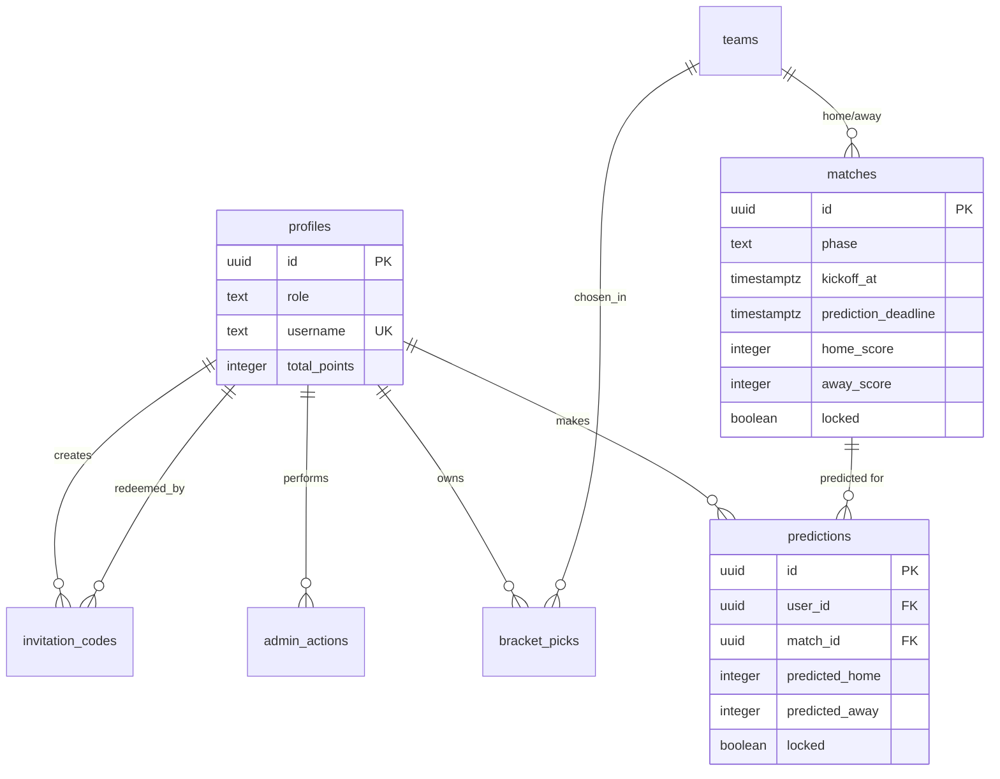

# La Mega Polla Mundialista — Database Schema

**Version**: 1.0  
**Date**: 29 May 2026  
**Status**: Draft — to be reviewed and approved before any migrations are run.

This document is the single source of truth for the Supabase (PostgreSQL) schema.

---

## Design Principles

- Config-driven and data-driven where possible (many values that could be hardcoded will live in the database).
- Strong use of Row Level Security (RLS).
- Auditability for anything an admin can change.
- Clear separation between user-owned data and system data.
- All timestamps stored as `timestamptz` (UTC).

---

## Core Tables

### 1. `profiles`

Extends `auth.users`. One row per authenticated user.

**Important identity rule**: Users are identified publicly by a **nickname / username**, not their email. The email from the OAuth provider is stored only in Supabase Auth and is never used as a public display name.

```sql
create table profiles (
  id uuid primary key references auth.users(id) on delete cascade,
  role text not null default 'participant' 
    check (role in ('participant', 'admin')),
  username text unique not null,              -- Public nickname / handle (chosen or assigned). Used on leaderboards, predictions, etc.
  display_name text,                          -- Optional friendly name
  avatar_url text,
  total_points integer not null default 0,
  joined_at timestamptz not null default now(),
  created_at timestamptz not null default now(),
  updated_at timestamptz not null default now()
);
```

**Identity & Privacy Notes**:
- `username` is the **public user ID** shown everywhere (leaderboard, "X predicted 2-1", etc.).
- Users should be able to choose or change their username (subject to uniqueness).
- The underlying OAuth email is never shown publicly.
- On first login after redeeming an invite, the user should be prompted to pick a username if one was not pre-assigned.

**RLS**:
- Users can read and update their own profile (including choosing their username).
- Admins can read and update all profiles.

### 2. `invitation_codes`

Used by admins to onboard new participants.

```sql
create table invitation_codes (
  id uuid primary key default gen_random_uuid(),
  code text unique not null,                    -- e.g. "MEGA-X7K9P2"
  created_by uuid references profiles(id),
  redeemed_by uuid references profiles(id),
  redeemed_at timestamptz,
  expires_at timestamptz,
  max_uses integer not null default 1,
  uses_count integer not null default 0,
  created_at timestamptz not null default now()
);
```

### 3. `teams`

The 48 official World Cup 2026 teams. Seeded once from FIFA data.

```sql
create table teams (
  id serial primary key,
  fifa_code char(3) unique not null,            -- MEX, ARG, etc.
  name_es text not null,                        -- "México", "Países Bajos"
  name_en text not null,
  group_letter char(1) not null check (group_letter between 'A' and 'L'),
  confederation text,
  flag_emoji text,
  created_at timestamptz not null default now()
);
```

### 4. `matches`

All 104 matches (72 group + 32 knockout).

```sql
create table matches (
  id uuid primary key default gen_random_uuid(),
  fifa_match_number integer unique,
  phase text not null check (phase in (
    'group_stage', 'round_of_32', 'round_of_16', 
    'quarter_final', 'semi_final', 'third_place', 'final'
  )),
  group_letter char(1),                         -- null for knockout
  home_team_id integer references teams(id),
  away_team_id integer references teams(id),
  home_source jsonb,                            -- for unresolved knockout matches
  away_source jsonb,
  kickoff_at timestamptz not null,
  venue text,
  prediction_deadline timestamptz not null,
  home_score integer,
  away_score integer,
  status text not null default 'scheduled' 
    check (status in ('scheduled','live','finished','postponed','cancelled')),
  created_at timestamptz not null default now(),
  updated_at timestamptz not null default now()
);
```

### 5. `predictions`

One row per user per match.

```sql
create table predictions (
  id uuid primary key default gen_random_uuid(),
  user_id uuid not null references profiles(id) on delete cascade,
  match_id uuid not null references matches(id) on delete cascade,
  predicted_home integer not null check (predicted_home between 0 and 20),
  predicted_away integer not null check (predicted_away between 0 and 20),
  submitted_at timestamptz not null default now(),
  locked boolean not null default false,
  admin_overridden boolean not null default false,
  admin_note text,
  created_at timestamptz not null default now(),
  updated_at timestamptz not null default now(),
  unique (user_id, match_id)
);
```

**Key behavior**: After `locked = true`, normal users cannot UPDATE this row. Only service role (admin) can.

### 6. `bracket_picks` (for tournament simulator)

Simplified for MVP, can be expanded later.

```sql
create table bracket_picks (
  id uuid primary key default gen_random_uuid(),
  user_id uuid not null references profiles(id) on delete cascade,
  pick_type text not null,                      -- 'champion', 'semi_finalist', etc.
  team_id integer references teams(id),
  created_at timestamptz not null default now(),
  updated_at timestamptz not null default now(),
  unique (user_id, pick_type, team_id)
);
```

### 7. `admin_actions` (audit log)

```sql
create table admin_actions (
  id bigserial primary key,
  admin_id uuid references profiles(id),
  action text not null,                         -- 'override_prediction', 'set_match_result', etc.
  target_type text,
  target_id text,
  details jsonb,
  created_at timestamptz not null default now()
);
```

### 8. `prediction_changes` (for the "pay with points to edit" mechanic)

New table required by the latest game rule (user can spend earned points to change 1 prediction per day after the tournament has started).

```sql
create table prediction_changes (
  id uuid primary key default gen_random_uuid(),
  user_id uuid not null references profiles(id) on delete cascade,
  prediction_id uuid not null references predictions(id),
  old_home integer not null,
  old_away integer not null,
  new_home integer not null,
  new_away integer not null,
  points_spent integer not null,                -- how many points this change cost the user
  change_date date not null,                    -- used to enforce "max 1 per day"
  created_at timestamptz not null default now()
);
```

This table serves both as an audit log and as the source for enforcing the daily limit. When a user attempts a paid change, we check how many rows exist for that `user_id` + `change_date`.

### 8. Future / Optional Tables (not in Phase 0)

- `user_match_points` (historical point breakdown per match)
- `matchday_bonuses` or streak tracking
- `config` table for runtime-tunable values (scoring, deadlines, etc.)

---

## Entity Relationship Diagram (Mermaid)



---

## RLS Policy Summary (High Level)

- `profiles`: owner + admin full access.
- `predictions`: owner can INSERT/UPDATE only while `locked = false` and before match deadline. SELECT allowed for own + (future) other users for visibility.
- `matches`: everyone can SELECT. Only service role can UPDATE scores.
- `invitation_codes`: admin only (via service role or very narrow policies).
- `admin_actions`: append-only for service role.

Full policy SQL will be provided in the migration files.

---

## Next Steps for This Schema

1. Review and approve this document.
2. Create the initial migration SQL.
3. Implement the corresponding TypeScript types (`Database` interface from `supabase gen types`).

This schema is designed to support the full feature set (group stage + knockout + bracket simulator + admin overrides + visibility of other predictions) while remaining config-friendly.